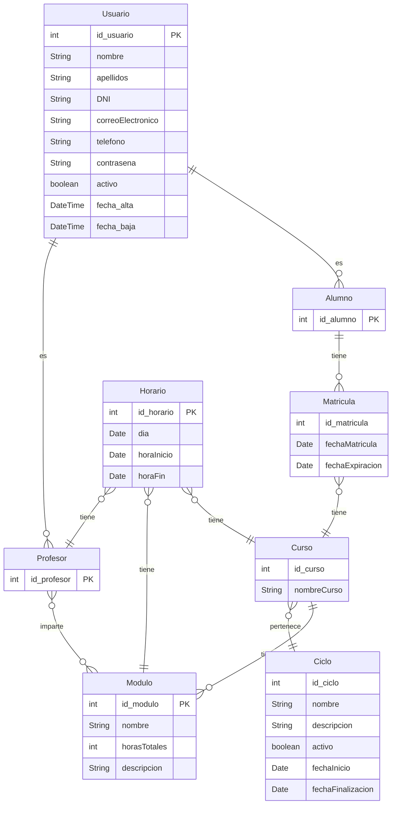

## Informacion del projecto:

Aplicación de **gestión escolar** orientada a centros educativos, que permite administrar alumnos, profesores, ciclos, módulos, matrículas y horarios, con acceso diferenciado según el tipo de usuario. 

El objetivo es centralizar la información académica y facilitar la consulta y gestión de datos.

## Lista de funcionalidades principales:

#### Alumno

1. Consultar su información personal (perfil alumnado)
2. Modificar su información personal
3. Crear, ver y darse de baja de las matrículas
4. Consultar horario
5. Ver información de ciclos y modulos a los que pertenece
6. Ver sus profesores asociados

#### Profesores

1. Consultar su información personal
2. Ver su horario
3. Crear y editar módulos
4. Crear ciclos y asignar módulos
5. Consultar alumnos matriculados
6. Consultar otros profesores y sus horarios

## Ampliación temporal a futuro:

1. Estadística
2. Exportación de datos
3. Un sistema de notificaciones si da tiempo.

## Entitades principales:

+ Usuario (alumno o profesor)
+ Alumno
+ Profesor
+ Modulo
+ Ciclo
+ Curso
+ Matricula
+ Horario

### Relaciones:

+ Un Usuario puede ser Alumno o Profesor.
+ Un Ciclo tiene varios Cursos.
+ Cada Curso pertenece a un único Ciclo.
+ Cada Curso tiene un Profesor tutor.
+ Un Profesor puede ser tutor de varios cursos.
+ Un Alumno se matricula en un Curso.
+ Un Curso puede tener varios Alumnos.
+ Un Ciclo tiene varios Módulos.
+ Cada Módulo pertenece a un Ciclo.
+ Un Profesor imparte Módulos en un Curso.
+ Cada Curso tiene un Horario propio.
+ El Horario se compone de las Imparticiones del curso.

## Modelo entidad relacion:

| Entidad 1 | Entidad 2 | Cardinalidad simple | FK va en…                      | Comentario                                                                   |
| --------- | --------- | ------------------- | ------------------------------ | ---------------------------------------------------------------------------- |
| Usuario   | Alumno    | 1:1                 | Alumno                         | Cada Alumno es un Usuario                                                    |
| Usuario   | Profesor  | 1:1                 | Profesor                       | Cada Profesor es un Usuario                                                  |
| Alumno    | Matrícula | 1:N                 | Matrícula                      | Un alumno puede tener varias matrículas                                      |
| Matrícula | Curso     | N:1                 | Matrícula                      | Cada matrícula pertenece a un único curso                                    |
| Curso     | Ciclo     | N:1                 | Curso                          | Cada curso pertenece a un ciclo                                              |
| Curso     | Módulo    | 1:N                 | Módulo                         | Cada curso tiene varios módulos                                              |
| Profesor  | Módulo    | N:N                 | Tabla intermedia `Imparticion` | Cada profesor puede impartir varios módulos, y cada módulo varios profesores |
| Horario   | Profesor  | N:1                 | Horario                        | Cada horario tiene un profesor                                               |
| Horario   | Módulo    | N:1                 | Horario                        | Cada horario corresponde a un módulo                                         |
| Horario   | Curso     | N:1                 | Horario                        | Cada horario corresponde a un curso                                          |

## Paso al modelo relacional [TABLAS]:

Usuario [
    int id_usuario PK
    varChar nombre
    varChar apellidos
    varchar DNI (constraint)
    varchar correoElectronico unique
    varchar telefono (constraint)
    varchar contrasena (ocultada)
    boolean activo (cuenta activa o no)
    DateTime fecha_alta
    DateTime fecha_baja
    ]

Alumno {
    int id_alumno PK
    constraint fk_alumno foreign key(id_alumno) reference Usuario(id_usuario)  
}

Profesor {
    int id_profesor PK
    constraint fk_profesor foreign key(id_profesor) reference Usuario(id_usuario)  
}

Matricula {
    int id_matricula PK
    DateTime fechaMatricula
    DateTime fechaExpiracion
    int id_usuario FK
    int id_curso FK
    constraint fk_matricula foreign key(id_usuario) reference alumno(id_alumno)
    constraint fk_matricula_curso foreign key(id_curso) reference curso(id_curso)
}

Curso {
    int id_curso PK
    String nombreCurso
    int id_ciclo fk
    constraint fk_curso foreign key(id_ciclo) references ciclo(id_ciclo)
}

Ciclo {
    int id_ciclo PK
    varchar nombre
    varchar descripcion
    boolean activo
    DateTime fechaInicio
    DateTime fechaFinalizacion
}

Modulo {
    int id_modulo PK
    varchar nombre
    int horasTotales
    varchar descripcion
    int id_curso FK
    constraint fk_modulo foreign key(id_curso) references curso(id_curso)
}

Profesor_Imparte {
    id_profesor fk
    id_modulo fk
    constraint fk_imparte_profesor foreign key(id_profesor) references profesor(id_profesor)
    constraint fk_imparte_modulo foreign key(id_modulo) references modulo(id_modulo)
    constraint pk_imparte primary key(id_profesor,id_modulo)
}

Horario {
    int id_horario PK
    Date dia
    Date horaInicio
    Date horaFin
    int id_curso
    int id_profesor 
    int id_modulo
    constraint fk_horario_curso foreign key(id_curso) references curso(id_curso)
    constraint fk_horario_profesor foreign key(id_profesor) references profesor(id_profesor)
    constraint fk_horario_modulo foreign key(id_modulo) references modulo(id_modulo)
}

